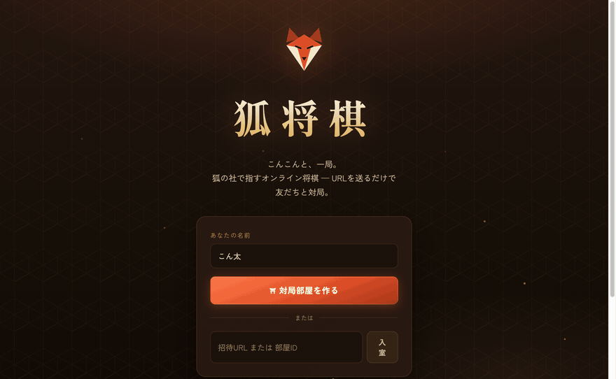

# 狐将棋 🦊 — こんこんと一局

狐（稲荷神社）をテーマにしたオンライン対局将棋サイト。
部屋を作ってURLを送るだけで、友だちと1対1の対局ができます。

**🦊 デモ: https://pregum-shogi.pregum-dev.workers.dev**



## 機能

- **オンライン対人戦** — ルームURL共有方式。アカウント登録不要
- **CPU対戦** — 強さ3段階のAI（ブラウザ内で思考、アルファベータ探索）
- **持ち時間** — 部屋作成時に「なし / 5分 / 10分 / 30分」を選択（切れ負け）。サーバー側で管理し、時間切れは自動判定
- **待った** — 対人戦は相手の承認制、CPU戦は自由に戻せる
- **棋譜の保存** — 終局時にブラウザ（localStorage）へ自動保存。棋譜庫で一覧・再生
- **KIF形式エクスポート** — 他の将棋ソフトで読み込めるKIFファイルをダウンロード
- **もう一局** — 先後を入れ替えて再戦
- **練習盤・遊び方ページ** — 1人で自由に駒を動かせる盤と、駒の動きの図解つきルール説明
- **手筋・囲いの勉強画面** — ふんどしの桂・割り打ちの銀などを動く盤面のアニメーションで解説
- **囲い完成エフェクト** — 対局中に矢倉・美濃・穴熊を組むと完成バナーとファンファーレが出る
- **効果音** — 駒音・王手・終局音（Web Audio合成、ON/OFF切替可）
- 完全な合法手判定（成り・持ち駒・二歩・打ち歩詰め・行き所のない駒・王手放置の禁止）
- 詰み・投了・**千日手**（連続王手の千日手含む）の自動判定、観戦、切断時の自動再接続

※ 持将棋（入玉宣言法）の自動判定は未対応です。

## 技術構成

| レイヤー | 技術 |
| --- | --- |
| フロントエンド | Vite + React + TypeScript |
| バックエンド | Cloudflare Workers + Durable Objects（WebSocket） |
| 将棋エンジン | 自前実装（`src/shared/shogi.ts`、クライアント・サーバー共用） |

1ルーム = 1 Durable Object。指し手はサーバー側で合法手検証してから全接続へブロードキャストします。

```
src/
├── shared/    # 将棋エンジン・KIF変換・WSプロトコル（両側で共用）
├── worker/    # Cloudflare Worker + ShogiRoom Durable Object
└── client/    # React UI（ホーム / 対局室 / 棋譜庫）
```

## 開発

```bash
npm install
npm run dev        # vite (5173, HMR) + wrangler dev (8787) を同時起動
```

- http://localhost:5173 … 開発用（/api は 8787 へプロキシ）
- http://127.0.0.1:8787 … ビルド済みアセットをWorkerが配信（本番同等）

```bash
npm test           # 将棋エンジンのユニットテスト（vitest）
npm run typecheck  # クライアント/ワーカー両方の型チェック
```

## デプロイ（Cloudflare）

```bash
npx wrangler login   # 初回のみ
npm run deploy       # vite build && wrangler deploy
```

Durable Objects は SQLite バックエンド（`new_sqlite_classes`）を使っているため **無料プランでもデプロイ可能** です。
デプロイ後は `https://pregum-shogi.<アカウント名>.workers.dev` で公開されます。
